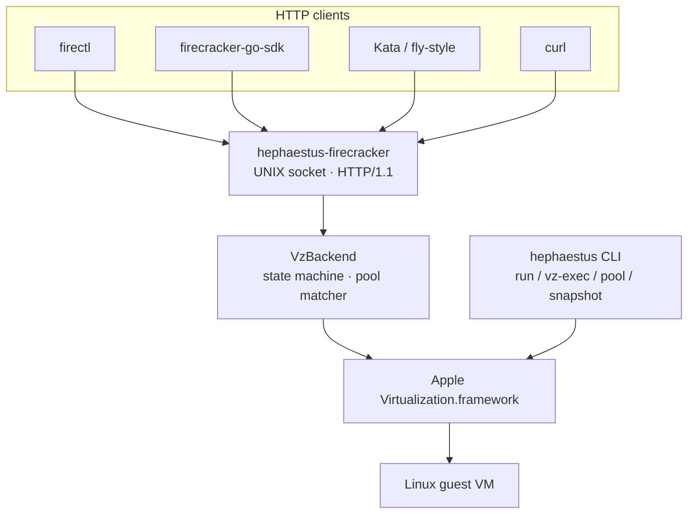

# hephaestus

> **Firecracker for macOS.** A drop-in replacement for the Firecracker
> HTTP API on Apple Silicon, built on Apple's Virtualization.framework.

[](https://github.com/hephaestus-vm/hephaestus/actions/workflows/ci.yml)
[](LICENSE)
[](https://www.apple.com/macos/)

---

Orchestrators like [Kata], [firectl], and fly-machines-style schedulers
speak one wire protocol — [Firecracker]'s. That protocol only runs on
Linux/KVM. If you want the same orchestration experience on an M-series
Mac, your options have been "run Firecracker in a Linux VM" or "don't."

**hephaestus** is a third option. It speaks Firecracker's HTTP wire
shapes verbatim (the [Go SDK] accepts it without modification) but
substitutes Apple's Virtualization.framework for KVM underneath. Your
existing orchestrator code points at a different UNIX socket and keeps
working.

> **Status: alpha.** The HTTP API, CLI, warm pool, snapshots, and
> experimental jailer supervisor work end-to-end. Multi-tenant hardening
> is still incomplete, and there are no stability guarantees pre-v1.0.
> Don't run untrusted guest code. See [Security](#security) and
> [Status at a glance](#status-at-a-glance).

[Kata]: https://katacontainers.io/
[firectl]: https://github.com/firecracker-microvm/firectl
[Firecracker]: https://github.com/firecracker-microvm/firecracker
[Go SDK]: https://github.com/firecracker-microvm/firecracker-go-sdk

## Architecture



Two entry points. `hephaestus-firecracker` is the HTTP API daemon —
one VM per process, matching upstream's contract. `hephaestus` is a
CLI for the cases where you don't want HTTP: boot a VM, exec one
command, take a snapshot, warm a pool.

Both share a Rust↔Swift FFI layer that wraps `VZVirtualMachine`,
`saveMachineStateTo:` / `restoreMachineStateFrom:`, and vsock. See
[docs/ARCHITECTURE.md](docs/ARCHITECTURE.md) for the full picture.

## Quickstart

### 1. The CLI warm-up

```bash
# Install from source (Homebrew tap coming — see Installation)
git clone https://github.com/hephaestus-vm/hephaestus
cd hephaestus
cargo build --release -p hephaestus-cli

# Boot a Linux VM and run one command
./build/cargo_target/release/hephaestus vz-exec \
    --kernel  /path/to/vmlinuz \
    --rootfs  /path/to/rootfs.ext4 \
    --cmd     'uname -a'
```

The VM boots, the command runs, the VM exits. ~300 ms cold start on
an M-series.

### 2. The Firecracker pitch

Same repo, different binary. Start the HTTP daemon:

```bash
./build/cargo_target/release/hephaestus-firecracker \
    --api-sock /tmp/fc.sock \
    --id       my-vm &
```

Then talk to it exactly like Firecracker:

```bash
sock=/tmp/fc.sock

curl --unix-socket $sock -X PUT localhost/machine-config \
    -H 'Content-Type: application/json' \
    -d '{"vcpu_count": 2, "mem_size_mib": 512}'

curl --unix-socket $sock -X PUT localhost/boot-source \
    -H 'Content-Type: application/json' \
    -d '{"kernel_image_path": "/path/to/vmlinuz"}'

curl --unix-socket $sock -X PUT localhost/drives/rootfs \
    -H 'Content-Type: application/json' \
    -d '{"drive_id": "rootfs", "path_on_host": "/path/to/rootfs.ext4",
         "is_root_device": true, "is_read_only": false}'

curl --unix-socket $sock -X PUT localhost/actions \
    -H 'Content-Type: application/json' \
    -d '{"action_type": "InstanceStart"}'
```

VM is Running. And yes — the [firecracker-go-sdk][Go SDK] works
unmodified; see [`compat/firectl-harness/`](compat/firectl-harness/)
for a 250-line program that drives the full 14-call sequence through
the real SDK.

## Status at a glance

| Area                                    | Status                                      |
| :-------------------------------------- | :------------------------------------------ |
| Firecracker HTTP API                    | Alpha — 14/14 SDK calls green on macOS      |
| CLI surface (`run` / `vz-exec` / `pool` / `snapshot`) | Working           |
| Warm pool + snapshot endpoints          | Working (~235 ms restore, see [Performance](#performance)) |
| Multi-tenant / untrusted guests         | **Not supported** — experimental jailer supervisor only |
| Cross-tool snapshot interop with real Firecracker | Impossible — different hypervisor blob formats |
| Public API stability                    | Breaking changes expected pre-v1.0          |

## Firecracker API compat

Endpoint-level status. See [docs/COMPAT.md](docs/COMPAT.md) for
per-endpoint notes and known deviations.

| Endpoint                              | hephaestus | Notes                                      |
| :------------------------------------ | :--------: | :----------------------------------------- |
| `GET /`                               | ✓          | `InstanceInfo` round-trips through Go SDK   |
| `GET/PUT/PATCH /machine-config`       | ✓          | CPU templates rejected on Apple Silicon     |
| `PUT /boot-source`                    | ✓          | kernel + boot args + optional initrd       |
| `PUT/PATCH /drives/{id}`              | ⚠︎         | Root + secondary drives (`/dev/vdb…`); `PATCH` pre-boot only |
| `PUT /network-interfaces/{id}`        | ⚠︎         | VZ NAT NIC attached; `guest_mac` honored, L3 up to guest |
| `PATCH /network-interfaces/{id}`      | ⚠︎         | Accept-noop (rate-limiter ignored)         |
| `PUT /logger`                         | ✓          | Firecracker-style text logs + debug access |
| `PUT /metrics`                        | ⚠︎         | Firecracker-style JSON; Linux counters zero |
| `PUT /actions` (`InstanceStart`, `FlushMetrics`, `SendCtrlAltDel`) | ✓ | Boot/restore, force metrics flush, or graceful guest stop |
| `PUT /entropy`                        | ✓          | virtio-rng always attached; request confirmed |
| `PUT/PATCH/GET /balloon`              | ⚠︎         | VZ traditional balloon; live target adjust; no stats |
| `PATCH /vm`                           | ✓          | `Paused ↔ Resumed`                         |
| `PUT /snapshot/create`                | ✓          | A+stub (single blob at `snapshot_path`)    |
| `PUT /snapshot/load`                  | ✓          | Round-trip across process restart          |
| `GET /version`                        | ✓          | Reports pinned Firecracker compat version  |
| `GET/PUT/PATCH /mmds`, `PUT /mmds/config` | ⚠︎     | Stored JSON; guest vsock/link-local path GETs via agent shim |
| `PUT /vsock`                         | ⚠︎         | Host UDS `CONNECT <port>` bridge after boot |
| cpu-config / pmem / serial / hotplug memory / vm config / balloon stats | ✗ | Routed, return Firecracker-shaped errors |

## Performance

Session-5 medians, 5 runs per path on an M-series, Alpine 3.20 guest,
2 vCPU / 512 MiB. See [docs/perf.md](docs/perf.md) for methodology
and how to reproduce.

| phase (ms)                | agent pool | stock pool | snapshot load |
| :------------------------ | ---------: | ---------: | ------------: |
| `cp -c` clone              |        4.0 |        4.5 |           n/a |
| config build              |       20.1 |       20.5 |          19.6 |
| VM construct              |        0.3 |        1.5 |           0.3 |
| **restoreMachineStateFrom** |  **228.9** |  **213.2** |     **214.5** |
| resume                    |        0.2 |        0.2 |           0.2 |
| **total**                 |  **253.0** |  **243.4** |     **234.7** |

Restore is dominated (~90 %) by VZ's `restoreMachineStateFrom:`
primitive. That's the floor on the path we control; anything faster
would need a Framework-level change.

## Installation

All three paths build an ad-hoc signed binary. The virtualization
entitlement is baked in via `hephaestus.entitlements` and applied by
`scripts/link-and-sign.sh` during build.

### Homebrew

Tap coming alongside the first non-alpha release. Until then, use the
source install below.

### Pre-built binaries

GitHub Releases attach `hephaestus` and `hephaestus-firecracker`
tarballs per tag. Because they're ad-hoc signed, macOS Gatekeeper will
quarantine them on first run:

```bash
curl -LO https://github.com/hephaestus-vm/hephaestus/releases/download/v0.3.0-alpha.1/hephaestus-aarch64-apple-darwin.tar.gz
tar xf hephaestus-aarch64-apple-darwin.tar.gz
xattr -d com.apple.quarantine hephaestus hephaestus-firecracker
./hephaestus ping
```

### From source

```bash
git clone https://github.com/hephaestus-vm/hephaestus
cd hephaestus
cargo build --release
# Binaries land under build/cargo_target/release/
```

### Requirements

- Apple Silicon Mac
- macOS 26 (Tahoe) or later
- Xcode 26 as the active developer directory (`xcode-select -p`)
- Rust stable (rustup or Homebrew)
- [`just`](https://github.com/casey/just) (optional, for bundled recipes)
- [`apple/container`](https://github.com/apple/container)
  (`brew install container`) — we reuse its cached kernel and rootfs
  artifacts in several recipes

## Contributing

PRs welcome. Each commit needs a `Signed-off-by:` line (run
`git commit -s`); no CLA. See
[CONTRIBUTING.md](CONTRIBUTING.md) for dev setup, style, and review
expectations. File an issue before starting a large feature so we can
align on scope.

## Security

**hephaestus assumes trusted guest code.** The `hephaestus-jailer`
supervisor can generate a per-VM deny-by-default macOS sandbox profile and
launch `hephaestus-firecracker` under it, and `hephaestus-firecracker` still
accepts an experimental `--sandbox-profile <file>` hook for custom profiles.
The sandbox recipes (`just fc-compat-sandbox-config`, `just fc-compat-sandbox`,
`just fc-compat-sandbox-vsock-e2e`, `just fc-compat-sandbox-snapshot`, and the
sandbox pool recipes) exercise generated profiles across config-only,
cold-boot, vsock/MMDS, snapshot, and warm-pool paths. This is not yet complete
multi-tenant hardening: launchd supervision, uid/gid isolation, and host-network
MMDS entitlements are still future work. Don't run untrusted code until those
pieces are built.

Please report vulnerabilities privately — see
[SECURITY.md](SECURITY.md) for scope and the reporting address.

## Acknowledgments

Built on [Firecracker][Firecracker] (wire types + API surface),
[apple/containerization] (Swift VM primitives used by the
`hephaestus run` path), [apple/container] (kernel + rootfs artifacts
the recipes consume), and the [firecracker-go-sdk][Go SDK]
(compatibility test harness). Full attribution lives in
[NOTICE](NOTICE).

[apple/containerization]: https://github.com/apple/containerization
[apple/container]: https://github.com/apple/container

## License

[Apache License 2.0](LICENSE).
