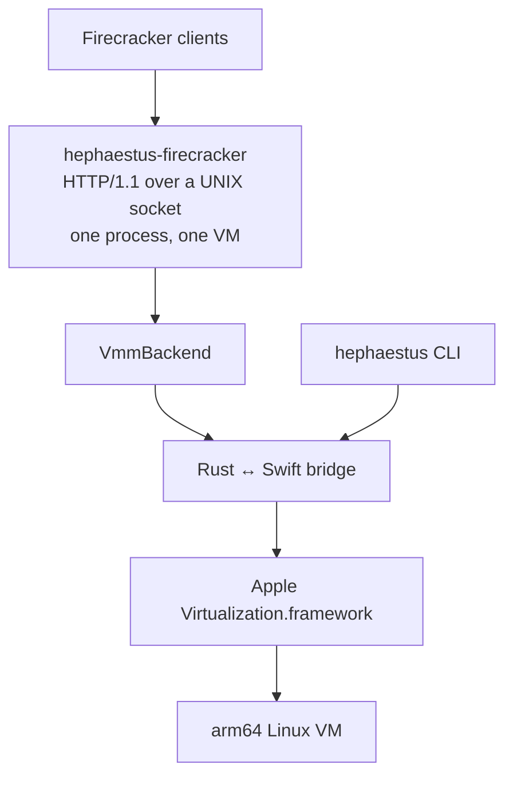

# Architecture

Hephaestus provides a Firecracker-compatible control plane on macOS while using
Apple's virtualization stack for VM execution.

## System overview



## Repository layout

```text
src/
├── hephaestus-cli/          `hephaestus` command
├── hephaestus-firecracker/  HTTP daemon and VZ backend
├── hephaestus-fc-api/       Firecracker wire types and backend trait
├── hephaestus-jailer/       Experimental sandbox supervisor
├── hephaestus-pool/         Persistent warm-pool primitive
├── hephaestus-vmm/          Public VMM facade
└── hephaestus-bridge/       Rust side of the Swift FFI
swift/HephaestusBridge/      VZ configuration and FFI implementation
guest/hephaestus-agent/      Linux command/MMDS agent
compat/firectl-harness/      Firecracker Go SDK regression client
vendor/firecracker/          Upstream source reference, excluded from workspace
```

The Cargo workspace contains the seven Hephaestus crates. The vendored
Firecracker tree is reference material for synchronizing API types and does not build on macOS.

## Two VM paths

### Containerization path

`hephaestus run` uses `apple/containerization`'s `LinuxContainer`. This path provides process management, stdout/stderr streaming, terminal wiring, and network attachment. Containerization does not expose the VZ save/restore API, so this path is not used for snapshots or the Firecracker daemon.

### Direct-VZ path

The `vz-*` commands and `hephaestus-firecracker` configure
`VZVirtualMachine` directly. This makes `saveMachineStateTo:` and
`restoreMachineStateFrom:` available for API snapshots and warm pools. The
direct path owns its process-delivery, console, vsock, and lifecycle plumbing.

## HTTP backend lifecycle

`VzBackend` implements the `VmmBackend` trait from `hephaestus-fc-api`. Its primary states are:

```text
NotStarted ── InstanceStart/snapshot load ──> Running ⇄ Paused
```

Construction-time resources are configured in `NotStarted`. Snapshot creation requires `Paused`; snapshot load requires `NotStarted`. `RunOrigin` records whether the current VM cold-booted, restored from a pool, or loaded a snapshot because later operations have origin-specific constraints.

The process owns one backend and one VM. A second VM requires a second daemon process and API socket.

## Warm pools

`hephaestus-pool` persists pool metadata, VM state, machine identifiers, and rootfs clones. A match key contains canonical kernel and rootfs paths, vCPU count, and memory size. Boot arguments are excluded: after restore, the guest continues with the command line captured in the saved state.

The agent flavor waits for a host command over vsock. The stock-init flavor boots the rootfs's normal init process and is intended for HTTP clients. See [Warm pools](../guides/warm-pools.md).

## Guest services

The direct path reserves vsock port 1234 for `hephaestus-agent` and port 16992 for MMDS. Firecracker-style `PUT /vsock` endpoints create additional host UDS bridges. See the [guest agent design](guest-agent.md) and [networking guide](../guides/networking.md).

## Further reading

- [Virtualization.framework mapping](virtualization-framework.md)
- [Rust/Swift FFI](ffi.md)
- [Firecracker compatibility](../firecracker-compatibility.md)
- [Performance](../performance.md)
- [Vendored Firecracker source](../../vendor/firecracker/README.md)
