# Release automation plan

This document describes the automated release pipeline and the remaining work
needed for production-grade distribution.

## Current state

The release foundation is implemented around `v0.4.0-alpha.1`:

- the three shipped host binaries share one product version;
- `version.txt` is the canonical release version;
- Release Please maintains version and changelog Release PRs from Conventional
  Commit squash titles using the `RELEASE_PLEASE_TOKEN` repository secret;
- merging a Release PR creates the version tag and GitHub Release;
- the tag workflow validates source, builds all host binaries, verifies signing,
  packages documentation, generates checksums and provenance, and uploads the
  assets;
- CI rejects non-conventional PR titles before they can become squash commits.

The one-time `v0.4.0-alpha.1` bootstrap release is published with its arm64
archive, checksum, and build-provenance attestation. Release Please has found
that baseline and now maintains subsequent Release PRs. Real-VM release tests
still require a suitable Mac and cannot currently run on ordinary hosted CI.

## Target workflow

The desired release process has one human decision: merging a generated Release
PR. Everything after that should be reproducible and automated.

```mermaid
flowchart LR
    Commits["Conventional commits on main"]
    ReleasePlease["Release Please"]
    ReleasePR["Generated Release PR<br/>version + changelog"]
    CI["CI and release validation"]
    Merge["Maintainer merge"]
    Tag["Version tag + GitHub Release"]
    Build["Pinned macOS release build"]
    Assets["Signed archives<br/>checksums + provenance"]

    Commits --> ReleasePlease
    ReleasePlease --> ReleasePR
    ReleasePR --> CI
    CI --> Merge
    Merge --> Tag
    Tag --> Build
    Build --> Assets
```

## Phase 1: establish one product version — implemented

`0.4.0-alpha.1` is the first canonical product version. `version.txt`, the
Release Please manifest, and all three shipped host packages agree. Release CI
rejects a tag when any of those package versions differ.

The Firecracker compatibility version remains separate: `GET /version` reports
protocol compatibility, not the Hephaestus product version.

The bootstrap tag and GitHub Release were created from the canonical version
and matching changelog section; their artifact workflow completed successfully.
Do not import unrelated tags from the upstream Firecracker history or create
future product tags manually.

One packaging decision remains: decide whether `hephaestus-agent` is versioned
and shipped with the host archive or built separately.

## Phase 2: generate release PRs and changelogs — implemented

Release Please runs against `main`:

- Conventional squash-merge titles become the changelog source.
- `feat` produces a minor bump, `fix` produces a patch bump, and `!` or a
  `BREAKING CHANGE` footer records a breaking change.
- Release Please maintains a Release PR containing the proposed version,
  `CHANGELOG.md`, and version-file updates.
- Maintainers can edit that PR to improve wording, group related changes, and
  call out migrations before merging.
- The `RELEASE_PLEASE_TOKEN` repository secret creates and updates the Release
  PR so normal pull-request CI runs; events created by the default
  `GITHUB_TOKEN` do not trigger other workflows. Use a narrowly scoped bot or
  fine-grained token when replacing the initial maintainer token.

Hephaestus should use a single root release component rather than publish every
internal crate independently. Any Cargo manifests that retain package versions
should be configured as extra version files and checked for consistency in CI.

## Phase 3: make artifact publication deterministic — implemented baseline

The artifact workflow is driven by the tag created from the Release PR. It:

1. Check out the exact tag with full tag history.
2. Select the same pinned Xcode and Rust toolchains used by CI.
3. Verify that the tag, canonical product version, Cargo metadata, and changelog
   section agree.
4. Run formatting, Clippy, workspace tests, documentation links, and both
   config-only compatibility suites before packaging.
5. Build optimized arm64 binaries.
6. Verify the `com.apple.security.virtualization` entitlement on every shipped
   host binary.
7. Package `hephaestus`, `hephaestus-firecracker`, and `hephaestus-jailer`, plus
   license, notice, README, and version metadata.
8. Include the guest agent only after its build and compatibility contract is
   defined.
9. Produces SHA-256 checksums and GitHub artifact provenance.
10. Uploads assets to the existing GitHub Release without regenerating release
    notes in a second place.

A failed artifact build leaves the Release Please release without binary assets,
which is visible but not ideal. Moving release creation behind successful
artifact validation, or using draft releases until upload completes, remains a
hardening task.

## Phase 4: release-gate real VM behavior

Hosted CI validates compilation and the control plane, but a production release
also needs the real-VM smoke family listed in the release policy. The durable
solution is a dedicated Apple Silicon runner with:

- supported macOS and Xcode versions;
- cached guest artifacts;
- required signing identities and profiles stored outside the repository;
- an environment approval gate for entitlement-sensitive jobs.

Until that runner exists, the Release PR must retain a manual checklist for cold
boot, networking, vsock/MMDS, snapshots, and both warm-pool flavors. Publication
should not imply those checks ran automatically.

## Phase 5: distribution hardening

After the basic pipeline is reliable:

- replace ad-hoc signatures with Developer ID signing;
- notarize release archives where appropriate;
- publish an SBOM alongside provenance;
- add a Homebrew tap driven from the same GitHub Release;
- define snapshot and pool compatibility across product versions;
- automate clean-machine coverage for the documented install and quarantine
  procedure.

## Required repository policy

The automation depends on repository policy as much as workflow YAML:

- squash merges must use Conventional Commit PR titles;
- CI must be required before merging normal and Release PRs;
- version tags must be created by automation, not pushed manually;
- workflow actions are pinned to reviewed commit SHAs and updated through
  Dependabot;
- only the release workflow receives `contents: write` and provenance
  permissions;
- changelog edits happen in the generated Release PR, not opportunistically in
  feature PRs.
